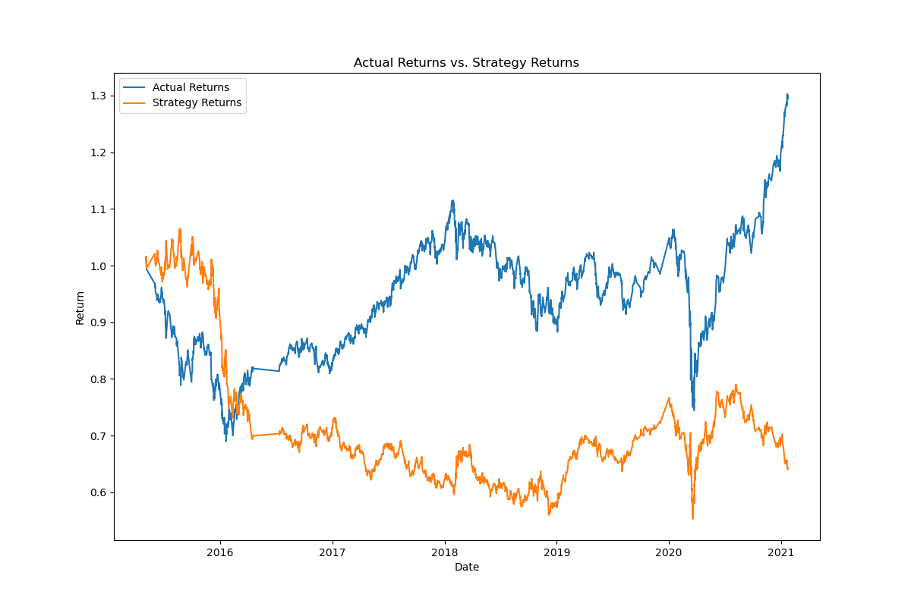
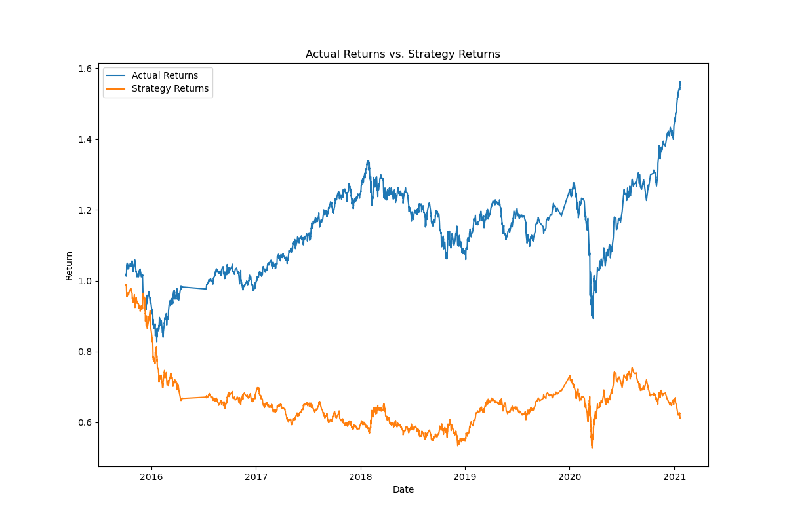
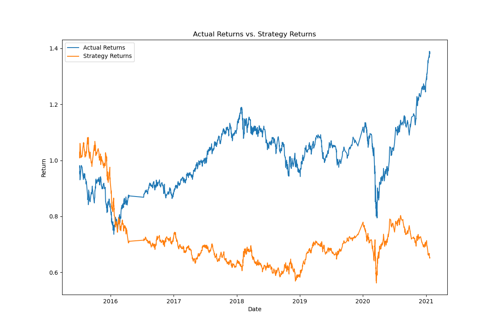
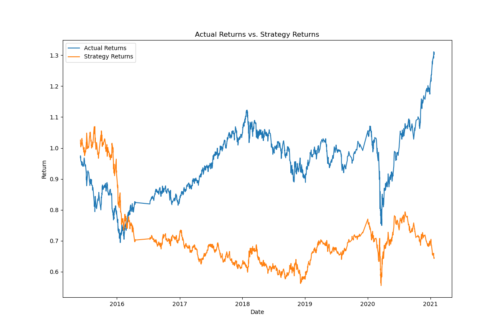

# challenge_14
Algorithmic Trading

Answer the following questions: 
Did this new model perform better or worse than the provided baseline model? 

The logistic model perofrmed significantly better than the provided baseline model. We can see that the precision, recall, f1 score, and accuracy measures went up across the board. 

BASELINE MODEL

              precision    recall  f1-score   support

        -1.0       0.41      0.08      0.13      1804
         1.0       0.56      0.91      0.69      2288

    accuracy                           0.54      4092
   macro avg       0.48      0.49      0.41      4092
weighted avg       0.49      0.54      0.44      4092

LOGISTIC MODEL 

  precision    recall  f1-score   support

        -1.0       0.44      0.32      0.37      1804
         1.0       0.56      0.68      0.61      2288

    accuracy                           0.52      4092
   macro avg       0.50      0.50      0.49      4092
weighted avg       0.51      0.52      0.51      4092

Did this new model perform better or worse than your tuned trading algorithm?

This model performed significantly better than the tuned training algorithm. In the tuned training algorithm, I used a short window of 20, and a long window of 50. In the logistic model, I kept the defaults, with a short window of 4, and a long window of 100.

We can see by all metrics that the recall, f1, and accuracy scores went down signficantly. 

LOGISTIC MODEL

  precision    recall  f1-score   support

        -1.0       0.44      0.32      0.37      1804
         1.0       0.56      0.68      0.61      2288

    accuracy                           0.52      4092
   macro avg       0.50      0.50      0.49      4092
weighted avg       0.51      0.52      0.51      4092

TUNED TRAINING ALGORITHM

 precision    recall  f1-score   support

        -1.0       0.00      0.00      0.00      1826
         1.0       0.56      1.00      0.72      2321

    accuracy                           0.56      4147
   macro avg       0.28      0.50      0.36      4147
weighted avg       0.31      0.56      0.40      4147

